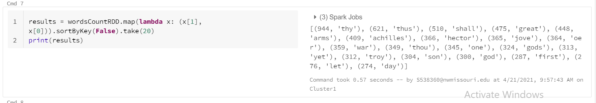
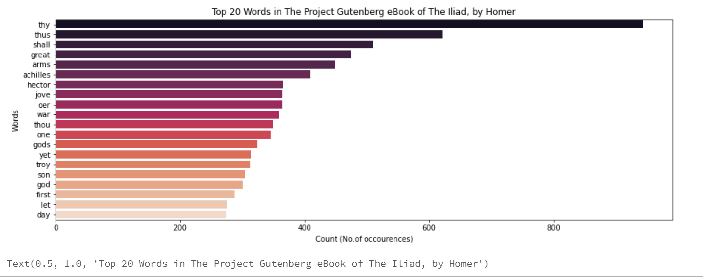

# Big-Data-final-project 

## About Me :woman:
- [Sumana Reddy Reddybathula](https://github.com/sumana-reddy)

## Link for Databricks published notebook :notebook:
- https://databricks-prod-cloudfront.cloud.databricks.com/public/4027ec902e239c93eaaa8714f173bcfc/7340731884324704/4073657483805730/3316173007748205/latest.html

## Source of text used 
- https://www.gutenberg.org/

## Process text using Databricks Community Edition and PySpark. 

Using PySpark for Natural language Processing
* Cleaning
* Processing
* Charting

### Cleaning 
   * NLP stopword removal
   * Remove all non-leters
   * To get data text from URL
```
import urllib.request
urllib.request.urlretrieve("https://www.gutenberg.org/files/6130/6130-0.txt", "/tmp/gutenberg.txt")

```
   * dbutils.fs.mv to transfer the data and Storing the data in gutenberg.txt

```
dbutils.fs.mv("file:/tmp/gutenberg.txt", "dbfs:/data/gutenberg.txt")

```
```
rawRDD = sc.textFile("dbfs:/data/gutenberg.txt")

```
### Processing 

   * Flatmap from one to many(one line of text to many words)
   * cast everything to lowercase
   * strip whitespace from beginning and end split by our delimiter (space, commma)
   * map() into intermediate key-value pairs
   * filter() to get just some records
   * reduceByKey() to get the count
   * flatmap each line to words
```
wordsRDD = rawRDD.flatMap(lambda line : line.lower().strip().split(" "))

```
   * map() words to (words,1) intermediate key-value pairs.
   * removing punctutations.
   * prepare to clean stopwords and remove spaces and empty words

```
import re
cleanTokenRDD = wordsRDD.map(lambda w: re.sub(r'[^a-zA-Z]','',w))
from pyspark.ml.feature import StopWordsRemover
removes =StopWordsRemover()
stopWords = removes.getStopWords()
cleanWordsRDD=cleanTokenRDD.filter(lambda w: w not in stopWords)
FinalcleanWordsRDD = cleanWordsRDD.filter(lambda x: x != "")
IKVPairsRDD= FinalcleanWordsRDD.map(lambda word: (word,1))

```
   * reduceByKey() to get (word, count) results
```
wordsCountRDD = IKVPairsRDD.reduceByKey(lambda acc, value: acc+value)

```

```
results = wordsCountRDD.map(lambda x: (x[1], x[0])).sortByKey(False).take(20)
print(results)

```
   * collect() action to get back to Python
```
finalresults = wordsCountRDD.collect()
print(finalresults)

```

### Charting :bar_chart:
   * Plot Options... was used to configure the graph below.
   * The Key is Year and appears on the X-Axis.
   * The Series groupings is Product and there is a different color to denote each of those.
   * The Values is salesAmount and appears on the Y-Axis.
```
import numpy as np
import pandas as pd
import matplotlib.pyplot as plt
import seaborn as sns
from collections import Counter

source = 'The Project Gutenberg eBook of The Iliad, by Homer'
title = 'Top 20 Words in ' + source
xlabel = 'Count (No.of occourences)'
ylabel = 'Words'

# create Pandas dataframe from list of tuples
df = pd.DataFrame.from_records(results, columns =[xlabel, ylabel]) 
print(df)

# create plot (using matplotlib)
plt.figure(figsize=(15,5))
sns.barplot(xlabel, ylabel, data=df, palette="rocket").set_title(title)

```   

## Results 

- 
- 

## References 
- https://docs.databricks.com/_static/notebooks/higher-order-functions-tutorial-python.html


